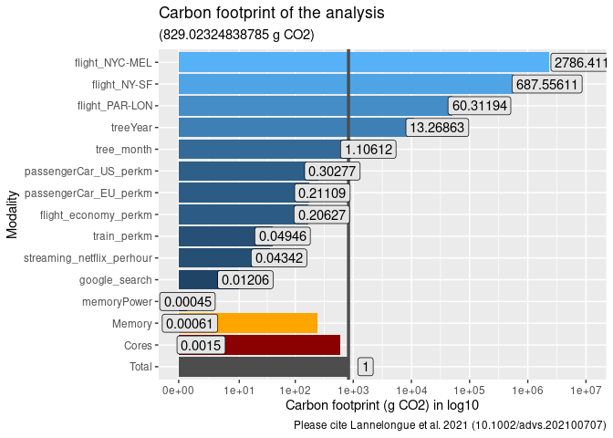

<!-- README.md is generated from README.Rmd. Please edit that file -->

<!-- devtools::build_readme() -->


[](https://www.gnu.org/licenses/gpl-3.0)
<!--  [](https://app.codecov.io/gh/adrientaudiere/greenAlgoR) -->
<!-- [](https://www.codefactor.io/repository/github/adrientaudiere/greenalgor/overview/master) -->

# greenAlgoR

This package computes ecological footprint in R (based on
[green-algorithms](https://calculator.green-algorithms.org/),
Lannelongue, Grealey, and Inouye (2021)). The aim is to facilitate the
programmatic used of green-algorithms using the function
`ga_footprint()`. Moreover, greenAlgoR made it simple to compute
ecological footprint of {[targets](https://github.com/ropensci/targets)}
pipelines using function `ga_targets()`.

It is a beta-version. Please submit issues if you found problems or if
you want to contribute.

## Installation

greenAlgoR is not available on CRAN for the moment. You can install the
stable development version from GitHub with:

``` r
if (!require("devtools", quietly = TRUE)) {
  install.packages("devtools")
}
devtools::install_github("adrientaudiere/greenAlgoR")
```

## Scientific foundation

### The algorithm from Lannelongue, Grealey, and Inouye (2021)

You can refer to
[green-algorithms](https://calculator.green-algorithms.org/) and
Lannelongue, Grealey, and Inouye (2021) to understand the algorithm.
Here is the short description from
[green-algorithms](https://calculator.green-algorithms.org/)

The carbon footprint is calculated by estimating the energy draw of the
algorithm and the carbon intensity of producing this energy at a given
location:

``` math
carbon footprint = energy needed * carbon intensity
```

Where the energy needed is:

``` math
runtime * (power draw for cores * usage + power draw for memory) * PUE * PSF
```

The power draw for the computing cores depends on the model and number
of cores, while the memory power draw only depends on the size of memory
available. The usage factor corrects for the real core usage (default is
1, i.e. full usage). The PUE (Power Usage Effectiveness) measures how
much extra energy is needed to operate the data centre (cooling,
lighting etc.).

The PSF (Pragmatic Scaling Factor) is used to take into account multiple
identical runs (e.g. for testing or optimisation). The Carbon Intensity
depends on the location and the technologies used to produce
electricity.

## Basic use

``` r
devtools::load_all()
library("greenAlgoR")
```

### In classical workflow

#### Using explicit input

``` r
# Your model must match exactly a name in TDP_cpu_internal$model
fp_12h <- ga_footprint(runtime_h = 12, cpu_model = "Core i3-10300")
fp_12h$carbon_footprint_total_gCO2
#> [1] 829.0232
fp_12h$energy_needed_kWh
#> [1] 1.745312
```

``` r
ggplot(fp_12h$ref_value, aes(
  y = variable,
  x = as.numeric(value),
  fill = log10(prop_footprint)
)) +
  geom_col() +
  geom_col(
    data = data.frame(
      variable = "Total",
      value = fp_12h$carbon_footprint_total_gCO2
    ),
    fill = "grey30"
  ) +
  geom_col(
    data = data.frame(
      variable = "Cores",
      value = fp_12h$carbon_footprint_cores
    ),
    fill = "darkred"
  ) +
  geom_col(
    data = data.frame(
      variable = "Memory",
      value = fp_12h$carbon_footprint_memory
    ),
    fill = "orange"
  ) +
  scale_x_continuous(
    trans = "log1p",
    breaks = c(0, 10^c(1:max(log1p(as.numeric(fp_12h$ref_value$value)))))
  ) +
  geom_vline(
    xintercept = fp_12h$carbon_footprint_total_gCO2,
    col = "grey30",
    lwd = 1.2
  ) +
  geom_label(
    aes(label = round_conditionaly(prop_footprint)),
    fill = "grey90",
    position = position_stack(vjust = 1.1)
  ) +
  labs(
    title = "Carbon footprint of the analysis",
    subtitle = paste0("(", fp_12h$carbon_footprint_total_gCO2, " g CO2", ")"),
    caption = "Please cite Lannelongue et al. 2021 (10.1002/advs.202100707)"
  ) +
  xlab("Carbon footprint (g CO2) in log10") +
  ylab("Modality") +
  theme(legend.position = "none")
```



#### Based on the R session

``` r
fp_session <- ga_footprint(runtime_h = "session", add_storage_estimation = TRUE)
fp_session$carbon_footprint_total_gCO2
#>  user.self 
#> 0.01989738
fp_session$energy_needed_kWh
#>    user.self 
#> 4.188922e-05
```

### Based on a targets pipeline

``` r
ga_targets()
```

## Roadmap

- [ ] Automatically find cpu model using benchmarkme::get_cpu()
- [ ] Submit to CRAN?

<div id="refs" class="references csl-bib-body hanging-indent"
entry-spacing="0">

<div id="ref-lannelongue_green_2021" class="csl-entry">

Lannelongue, Loïc, Jason Grealey, and Michael Inouye. 2021. “Green
Algorithms: Quantifying the Carbon Footprint of Computation.” *Advanced
Science* 8 (12): 2100707. <https://doi.org/10.1002/advs.202100707>.

</div>

</div>
