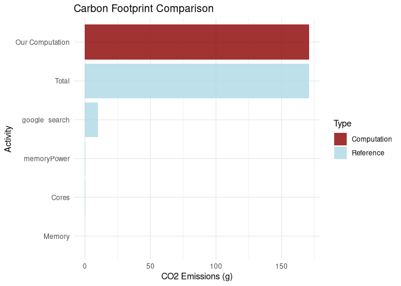

<!-- README.md is generated from README.Rmd. Please edit that file -->

<!-- devtools::build_readme() -->


[](https://www.gnu.org/licenses/gpl-3.0)
[](https://doi.org/10.5281/zenodo.14184331)
[](https://app.codecov.io/gh/adrientaudiere/greenAlgoR)
[](https://www.codefactor.io/repository/github/adrientaudiere/greenalgor/overview/master)

# greenAlgoR: Carbon Footprint Estimation for R Computations

**Calculate the environmental impact of your R computations** 🌱

The `greenAlgoR` package provides tools to estimate the carbon footprint
and energy consumption of computational tasks in R. Based on the Green
Algorithms framework (Lannelongue, Grealey, and Inouye (2021)), this
package helps researchers and data scientists understand and minimize
the environmental impact of their computational work.

## ✨ Key Features

- 🔍 **Calculate CO2 emissions** from R computations based on runtime,
  CPU, and memory usage
- 🌍 **Location-aware estimates** using regional carbon intensity data
- 🎯 **Targets integration** for complete pipeline carbon footprint
  analysis  
- 📊 **Visualization tools** to compare and contextualize your footprint
- ⚙️ **Flexible configuration** for different hardware specifications

## 🚀 Quick Start

``` r
library(greenAlgoR)

# Calculate footprint for a 2-hour computation
result <- ga_footprint(runtime_h = 2, location_code = "WORLD")
result$carbon_footprint_total_gCO2  # CO2 emissions in grams

# For your current R session
session_footprint <- ga_footprint(runtime_h = "session")

# For targets pipelines (in a targets project)
targets_footprint <- ga_targets()
```

## Installation

greenAlgoR is not available on CRAN for the moment. You can install the
stable development version from GitHub with:

``` r
# Install from GitHub (development version)
if (!require("devtools", quietly = TRUE)) {
  install.packages("devtools")
}
devtools::install_github("adrientaudiere/greenAlgoR")
```

## Scientific Foundation

### The Green Algorithms Framework

This package implements the methodology from Lannelongue, Grealey, and
Inouye (2021), which provides a standardized approach to quantifying the
carbon footprint of computational research. The framework considers:

- **Energy consumption**: Based on CPU usage, memory requirements, and
  runtime
- **Carbon intensity**: Varies by geographical location and energy
  sources  
- **Hardware efficiency**: Different processors and systems have varying
  power draws
- **Infrastructure**: Data center efficiency (PUE - Power Usage
  Effectiveness)

### The Algorithm

The carbon footprint is calculated by estimating the energy draw of the
algorithm and the carbon intensity of producing this energy at a given
location:

$$\text{carbon footprint} = \text{energy needed} \times \text{carbon intensity}$$

Where the energy needed is:

$$\text{runtime} \times (\text{power draw for cores} \times \text{usage} + \text{power draw for memory}) \times \text{PUE} \times \text{PSF}$$

The key factors are: - **Power draw for cores**: Depends on CPU model
and number of cores - **Memory power draw**: Based on available RAM
memory - **Usage factor**: Corrects for actual core utilization
(default: 100%) - **PUE**: Power Usage Effectiveness for data center
efficiency - **PSF**: Pragmatic Scaling Factor for multiple runs -
**Carbon intensity**: Location-dependent based on energy sources

## 📖 Examples

``` r
library("greenAlgoR")
```

### Basic Usage

#### Simple Calculation

``` r
# Calculate footprint for a 2-hour computation
result <- ga_footprint(
  runtime_h = 2,
  location_code = "WORLD",  # Global average
  n_cores = 4,
  memory_ram = 16
)

cat("Carbon footprint:", result$carbon_footprint_total_gCO2, "g CO2\n")
#> Carbon footprint: 85.60754 g CO2
cat("Energy consumption:", result$energy_needed_kWh, "kWh\n")
#> Energy consumption: 0.1802264 kWh
```

#### Using CPU Model

``` r
# Specify exact CPU model (automatically sets cores and TDP)
fp_specific <- ga_footprint(
  runtime_h = 1, 
  cpu_model = "Core i3-10300",
  location_code = "FR"  # France (low carbon intensity)
)

fp_specific$carbon_footprint_total_gCO2
#> [1] 7.458519
```

#### Location Comparison

``` r
# Compare carbon footprint across different locations
locations <- c("WORLD", "FR", "US", "NO", "CN")
footprints <- sapply(locations, function(loc) {
  ga_footprint(runtime_h = 1, location_code = loc)$carbon_footprint_total_gCO2
})

comparison <- data.frame(Location = locations, CO2_grams = footprints)
print(comparison)
#>       Location  CO2_grams
#> WORLD    WORLD 29.4247968
#> FR          FR  3.1766391
#> US          US 26.2617860
#> NO          NO  0.4720357
#> CN          CN 33.2902858
```

### Visualization

``` r
# Create a simple comparison plot
fp_example <- ga_footprint(runtime_h = 4, n_cores = 4, memory_ram = 16)

# Simple reference comparison
ref_subset <- fp_example$ref_value[1:5, ]  # Top 5 reference activities
ref_subset$type <- "Reference"

# Add our computation
our_computation <- data.frame(
  variable = "Our Computation",
  value = fp_example$carbon_footprint_total_gCO2,
  prop_footprint = NA,
  type = "Computation"
)

plot_data <- rbind(ref_subset[, c("variable", "value", "type")], 
                   our_computation[, c("variable", "value", "type")])
plot_data$value <- as.numeric(plot_data$value)

ggplot(plot_data, aes(x = reorder(variable, value), y = value, fill = type)) +
  geom_col(alpha = 0.8) +
  scale_fill_manual(values = c("Reference" = "lightblue", 
                              "Computation" = "darkred")) +
  coord_flip() +
  labs(
    title = "Carbon Footprint Comparison", 
    x = "Activity", 
    y = "CO2 Emissions (g)",
    fill = "Type"
  ) +
  theme_minimal()
```



### Current R Session

Calculate the carbon footprint of your current R session:

``` r
# Analyze current R session
fp_session <- ga_footprint(runtime_h = "session", add_storage_estimation = TRUE)
cat("Session footprint:", fp_session$carbon_footprint_total_gCO2, "g CO2\n")
#> Session footprint: 0.01999902 g CO2
cat("Session runtime:", fp_session$runtime_h, "hours\n")
#> Session runtime: 0.0006766667 hours
```

### Targets Pipeline Integration

For `targets` workflows, calculate the complete pipeline footprint:

``` r
# In a targets project directory
pipeline_footprint <- ga_targets(
  location_code = "FR",
  n_cores = 4,
  memory_ram = 16
)
pipeline_footprint$carbon_footprint_total_gCO2
```

## 📚 Documentation

- **Getting Started**: See `vignette("greenAlgoR-intro")` for
  comprehensive examples
- **Targets Integration**: See `vignette("targets-integration")` for
  pipeline analysis
- **Function Reference**: Use `?ga_footprint` and `?ga_targets` for
  detailed documentation

## 🤝 Contributing

We welcome contributions! Please:

1.  Check existing
    [issues](https://github.com/adrientaudiere/greenAlgoR/issues)
2.  Submit bug reports or feature requests
3.  Fork the repository and submit pull requests
4.  Follow the existing code style and add tests for new features

## 💡 Best Practices

- **Optimize your code**: Reduce runtime to minimize carbon footprint
- **Choose efficient hardware**: Match computational resources to your
  needs  
- **Consider location**: Run computations in regions with cleaner energy
- **Monitor regularly**: Track your carbon footprint across projects
- **Share awareness**: Include carbon footprint in research reporting

## 🔄 Roadmap

- [ ] Submit to CRAN
- [ ] Allow custom carbon intensity values (e.g., from [Electricity
  Maps](https://app.electricitymaps.com/))
- [ ] Add more visualization options

## 📄 Citation

If you use `greenAlgoR` in your research, please cite both the package
and the underlying methodology:

    # For greenAlgoR package
    Taudière, A. (2024). greenAlgoR: Carbon Footprint Estimation for R Computations. 
    R package version 0.1.1. https://github.com/adrientaudiere/greenAlgoR

    # For the Green Algorithms methodology  
    Lannelongue, L., Grealey, J., Inouye, M. (2021). Green Algorithms: 
    Quantifying the Carbon Footprint of Computation. Advanced Science, 8(12), 2100707.
    https://doi.org/10.1002/advs.202100707

# Frequently Asked Questions and Troubleshooting

## General Questions

### What is greenAlgoR?

`greenAlgoR` is an R package that estimates the carbon footprint and
energy consumption of computational tasks. It’s based on the Green
Algorithms framework by Lannelongue et al. (2021) and helps researchers
understand the environmental impact of their computational work in R.

### How accurate are the estimates?

The estimates are based on the peer-reviewed Green Algorithms
methodology and use real-world data for: - CPU power consumption from
hardware specifications - Regional carbon intensity from energy grid
data - Memory power consumption from published research

However, actual consumption may vary based on specific hardware
configurations, software optimization, and other factors.

### Which locations are supported?

The package supports carbon intensity data for many countries and
regions. Common location codes include: - `"WORLD"` - Global average -
`"US"` - United States - `"GB"` - United Kingdom - `"DE"` - Germany -
`"CN"` - China - `"FR"` - France

See the Green Algorithms database for the complete list.

## Common Issues

### “CPU model not found” error

**Problem**: You get an error when specifying a `cpu_model`.

**Solution**: 1. Use `"Any"` to use generic TDP values instead of a
specific model 2. Check that your CPU model name exactly matches the
Green Algorithms database 3. Manually specify `TDP_per_core` and
`n_cores` instead of using `cpu_model`

### Memory detection issues

**Problem**: Memory RAM is not detected automatically.

**Solution**: Manually specify the `memory_ram` parameter:

``` r
ga_footprint(runtime_h = 1, memory_ram = 16)  # 16 GB
```

### Session runtime calculation

**Problem**: `runtime_h = "session"` gives unexpected results.

**Explanation**: Session runtime is calculated from when R started, not
when your analysis began. For specific computations, use explicit
runtime:

``` r
# Time a specific operation
start_time <- Sys.time()
# ... your computation ...
end_time <- Sys.time()
runtime_hours <- as.numeric(difftime(end_time, start_time, units = "hours"))

ga_footprint(runtime_h = runtime_hours)
```

### Targets pipeline issues

**Problem**: `ga_targets()` fails or gives zero footprint.

**Solutions**: 1. Ensure you’re in a directory with a targets project 2.
Check that targets have been run with `tar_make()` 3. Verify targets
metadata exists:

``` r
# Check if targets data exists
targets::tar_meta()

# If no data, run the pipeline first
targets::tar_make()
```

## Best Practices

### Choosing appropriate parameters

**Hardware Configuration**: - Use actual hardware specs when possible -
For cloud computing, check provider documentation - Personal laptops
typically have PUE close to 1.0 - Data centers typically have PUE =
1.2-2.0

**Location Selection**: - Use your actual geographical location - For
cloud computing, use the data center location - Consider running
computations in regions with cleaner energy (lower carbon intensity)

### Optimizing for lower carbon footprint

1.  **Reduce runtime**: Optimize your code for efficiency
2.  **Choose efficient hardware**: Match resources to your needs
3.  **Select clean energy regions**: Run computations where renewable
    energy is prevalent
4.  **Cache results**: Avoid re-running expensive computations
5.  **Profile your code**: Identify and optimize bottlenecks

### Integration with workflows

**For research projects**:

``` r
# Include in your analysis scripts
footprint <- ga_footprint(runtime_h = "session")
cat("Analysis carbon footprint:", footprint$carbon_footprint_total_gCO2, "g CO2\n")

# Save for reporting
saveRDS(footprint, "results/carbon_footprint.rds")
```

**For targets pipelines**:

``` r
# Add to your _targets.R file
list(
  # ... your other targets ...
  tar_target(
    carbon_footprint,
    ga_targets(location_code = "FR"),
    description = "Calculate pipeline carbon footprint"
  )
)
```

## Technical Details

### Understanding the output

The `ga_footprint()` function returns a list with detailed breakdown:

- `carbon_footprint_total_gCO2`: Total CO2 emissions in grams
- `carbon_footprint_cores`: CPU contribution to emissions
- `carbon_footprint_memory`: Memory contribution to emissions  
- `energy_needed_kWh`: Total energy consumption in kilowatt-hours
- `runtime_h`: Actual runtime used in calculation
- `ref_value`: Reference activities for comparison (if requested)

### Customizing calculations

**Custom carbon intensity**: Currently, the package uses predefined
carbon intensity values per country. If you are interested in custom
values, please post an issue.

**Custom hardware parameters**: You can specify hardware configurations:

``` r
ga_footprint(
  runtime_h = 2,
  TDP_per_core = 25,    # High-performance CPU
  n_cores = 16,         # Many cores
  memory_ram = 128,     # Large memory
  PUE = 1.4,           # Data center efficiency
  PSF = 3              # Account for 3 repeated runs
)
```

## Getting Help

1.  **Check the documentation**: Use `?ga_footprint` and `?ga_targets`
2.  **Read the vignettes**: `vignette("greenAlgoR-intro")` and
    `vignette("targets-integration")`
3.  **Report issues**: Submit bug reports at
    <https://github.com/adrientaudiere/greenAlgoR/issues>

## Contributing

We welcome contributions! See the repository README for guidelines on: -
Reporting bugs - Suggesting features  
- Submitting code improvements - Improving documentation

## References

- Lannelongue, L., Grealey, J., Inouye, M. (2021). Green Algorithms:
  Quantifying the Carbon Footprint of Computation. Advanced Science,
  8(12), 2100707.
- Green Algorithms website: <https://calculator.green-algorithms.org/>
- Package repository: <https://github.com/adrientaudiere/greenAlgoR>

<div id="refs" class="references csl-bib-body hanging-indent"
entry-spacing="0">

<div id="ref-lannelongue_green_2021" class="csl-entry">

Lannelongue, Loïc, Jason Grealey, and Michael Inouye. 2021. “Green
Algorithms: Quantifying the Carbon Footprint of Computation.” *Advanced
Science* 8 (12): 2100707. <https://doi.org/10.1002/advs.202100707>.

</div>

</div>
